# FitJourney

NoSQL/backend project — a workout and progress tracking app built on MongoDB.
Users build workout plans, log sessions (sets, reps, weight, duration), track personal
records and body measurements, and view progress charts. Trainers create and assign plans
to clients and monitor their progress.

```
nbp/
├── backend/            ASP.NET Core + MongoDB API (Clean Architecture)
├── frontend/           React + Vite + Tailwind UI
└── docker-compose.yml  MongoDB (mongo:7) for local development
```

**Stack:** ASP.NET Core (.NET 10) · MongoDB · MediatR (CQRS) · React 18 + Vite · TailwindCSS

---

## Setup instructions

### Prerequisites
- .NET 10 SDK
- Node.js 18+
- Docker (for the local MongoDB), or a MongoDB connection string

### 1. MongoDB
```bash
docker compose up -d                 # mongo:7 on localhost:27017
```

### 2. Backend
```bash
cd backend/src/FitJourney.API
dotnet run --seed                    # one-time: seed demo users, exercises, plans, sessions
dotnet run --launch-profile http     # http://localhost:5109
```
Swagger UI: `http://localhost:5109/swagger`

### 3. Frontend (new shell)
```bash
cd frontend
npm install
npm run dev                          # http://localhost:5173
```
In development Vite proxies `/api` and `/uploads` to the backend on `:5109`.

### Demo accounts (password: `password123`)
| Email | Role |
|-------|------|
| `admin@fit.io` | Admin |
| `besirovicajsa@gmail.com` | Trainer (4 clients) |
| `user1@fit.io`, `user2@fit.io`, `user3@fit.io` | Users with seeded workout history |

---

## Deployment

The app is cloud-portable; all environment-specific settings are read from environment variables.

- **MongoDB** → MongoDB Atlas.
- **Backend** → any Docker host (e.g. Render); a `Dockerfile` is included in `backend/`.
- **Frontend** → any static host; build with `npm run build` (output in `dist/`).
- **Progress photos** → Cloudinary when configured, otherwise saved to local disk.

### Backend environment variables
| Variable | Purpose |
|----------|---------|
| `Mongo__ConnectionString` | MongoDB connection string |
| `Mongo__DatabaseName` | Database name (default `fitjourney`) |
| `Jwt__Secret` | JWT signing secret (≥ 32 chars; required outside Development) |
| `Cors__AllowedOrigins__0` | Deployed frontend origin (adds to the localhost defaults) |
| `Cloudinary__Url` | `cloudinary://<key>:<secret>@<cloud>` — enables Cloudinary photo storage |
| `PORT` | Port to bind (injected by most hosts) |

### Frontend environment variable
| Variable | Purpose |
|----------|---------|
| `VITE_API_URL` | Backend API base, e.g. `https://your-api.example.com/api/v1` |

---

## Architecture overview

The backend follows **Clean Architecture** with one-directional dependencies (outer layers
depend inward; the Domain depends on nothing):

```
FitJourney.API            Controllers, middleware, Swagger, DI composition root
   │  depends on
FitJourney.Application     CQRS (MediatR commands/queries + handlers), DTOs,
   │  depends on           FluentValidation, AutoMapper profiles, IUnitOfWork
FitJourney.Domain          Entities + repository/UoW interfaces (no dependencies)
   ▲
FitJourney.Infrastructure  MongoDB repositories, UnitOfWork, JWT service, seeder
                           (implements Domain interfaces)
```

- **CQRS** via MediatR — every use case is a `Command`/`Query` + `Handler` under `Features/`.
- **Repository + Unit of Work** — one repository per aggregate (`Domain/Interfaces`,
  implemented in `Infrastructure/Repositories`); `IUnitOfWork` aggregates them and provides the
  logical commit boundary (e.g. refresh-token rotation).
- **AutoMapper** — Entity ↔ DTO and Document ↔ Entity mapping profiles.
- **Cross-cutting** — JWT access + refresh (with rotation & revoke list), FluentValidation
  pipeline behavior, Serilog structured logging, RFC 7807 Problem Details exception handling,
  URL-segment API versioning, and two custom middlewares (response-time, exception handling).
- **Custom middleware** — `X-Response-Time` header + slow-request warning logs (threshold 500ms),
  persisted to a capped `requestLogs` collection.
- **Six MongoDB aggregation pipelines** — weekly volume, exercise progression (Epley 1RM),
  muscle balance (`$lookup` + `$unwind`), workout frequency, streak, plan completion rate.
- **Role-based access** — User / Trainer / Admin enforced at the controller level.

---

## Data model (ER diagram)

Sessions embed their sets; plans reference exercises with a name snapshot. The `planAssignments`
collection is the join between plans, the assigned user, and the assigning trainer.

```mermaid
erDiagram
    USERS ||--o| TRAINERPROFILES : "has (1 per trainer)"
    TRAINERPROFILES }o--o{ USERS : "coaches (clientIds)"
    USERS ||--o{ WORKOUTPLANS : authors
    USERS ||--o{ WORKOUTSESSIONS : logs
    USERS ||--o{ MEASUREMENTS : records
    USERS ||--o{ PERSONALRECORDS : holds
    USERS ||--o{ PROGRESSPHOTOS : uploads
    USERS ||--o{ NOTIFICATIONS : receives
    USERS ||--o{ REFRESHTOKENS : owns
    USERS ||--o{ MESSAGES : "sends (fromUserId)"
    USERS ||--o{ MESSAGES : "receives (toUserId)"
    WORKOUTPLANS ||--o{ PLANASSIGNMENTS : "assigned via"
    USERS ||--o{ PLANASSIGNMENTS : "assigned to (userId)"
    USERS ||--o{ PLANASSIGNMENTS : "assigned by (assignedBy)"
    WORKOUTPLANS }o--o{ EXERCISES : "references (days[].exercises[])"
    WORKOUTSESSIONS }o--o{ EXERCISES : "references (exercises[] + snapshot)"
    PERSONALRECORDS }o--|| EXERCISES : "for"

    USERS {
        ObjectId _id
        string name
        string email
        string passwordHash
        string role "user|trainer|admin"
        string avatarUrl
        object profile "gender,dateOfBirth,heightCm,currentWeightKg,targetWeightKg,experience,goal"
        ObjectId activePlanId FK
    }
    TRAINERPROFILES {
        ObjectId _id
        ObjectId userId FK
        string[] certifications
        string specialization
        double pricePerPlan
        string bio
        ObjectId[] clientIds FK
    }
    EXERCISES {
        ObjectId _id
        string name
        string type
        string[] primaryMuscles
        string[] secondaryMuscles
        string category
        string equipment
        int difficulty
        bool isCustom
        ObjectId createdBy
    }
    WORKOUTPLANS {
        ObjectId _id
        ObjectId authorId FK
        string authorName
        string name
        string visibility "private|public"
        string status
        string goal
        string level
        int durationWeeks
        int daysPerWeek
        object[] days "embedded; days[].exercises[] reference EXERCISES"
    }
    WORKOUTSESSIONS {
        ObjectId _id
        ObjectId userId FK
        ObjectId planId FK
        int planDayNumber
        datetime startedAt
        datetime endedAt
        object[] exercises "embedded; exercises[].sets[] embedded"
        double totalVolumeKg
        int completedSets
        int durationSec
    }
    PLANASSIGNMENTS {
        ObjectId _id
        ObjectId planId FK
        ObjectId userId FK
        ObjectId assignedBy FK
        string status
        datetime assignedAt
        datetime updatedAt
    }
    MEASUREMENTS {
        ObjectId _id
        ObjectId userId FK
        datetime date
        double weightKg
        double waistCm
        double chestCm
        double armCm
        double thighCm
        double bodyFatPct
    }
    PERSONALRECORDS {
        ObjectId _id
        ObjectId userId FK
        ObjectId exerciseId FK
        string exerciseName
        string type "1rm|5rm|volume"
        double weightKg
        int reps
        double oneRepMax
        ObjectId sessionId FK
        datetime achievedAt
    }
    PROGRESSPHOTOS {
        ObjectId _id
        ObjectId userId FK
        string url
        datetime takenAt
        string note
        datetime createdAt
    }
    MESSAGES {
        ObjectId _id
        ObjectId fromUserId FK
        ObjectId toUserId FK
        string fromName
        string toName
        string body
        datetime createdAt
        datetime readAt
    }
    NOTIFICATIONS {
        ObjectId _id
        ObjectId userId FK
        string type
        string title
        string body
        string link
        datetime createdAt
        datetime readAt
    }
    REFRESHTOKENS {
        ObjectId _id
        ObjectId userId FK
        string token
        datetime expiresAt
        bool isRevoked
        string replacedByToken
    }
```



> A capped `requestLogs` collection is also written by the response-time middleware (request
> method, path, status, duration, timestamp). It is telemetry with no enforced relationships,
> so it is omitted from the domain diagram above.
